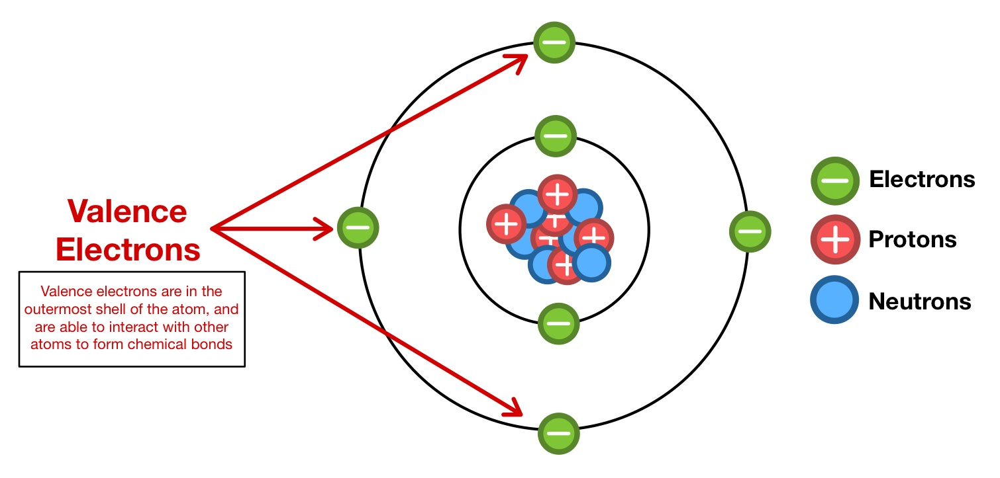

# What is AC currents ? #
- AC stands for alternating current.
- AC can be step up or down using transformer. By stepping voltage up into 100 of 1000 of voltage, we can transmit the power at the lower current. This reduces the amount of power loss in transmission. The voltage is then stepped back down into the more usable value of 100 of voltage that can be used in our home.

# How positive and negative charges are generated ? #
- All material are made up of atoms. The atom has a posivitively charged nucleus and negatively charged electron sorrounding the nucleus. 
- Negative charge electrons are bounded to nucelus due to their opposite nature compared to positively charge proton.

- <b> Valence electron </b>: electron in the outermost shell of the atom called the valence shell can become free if we apply to external forces becaused they are under balanced by positively charged protons.

- Normally copper cable is used for transferring electricity because atom that formed copper cable are used to move across the cable.

# What is polarity changes in AC current? #

- In AC circuit, the voltage provided by transformer is changing the polarity from positive to negative and vice-versa. For example, voltage from 0 to 8.3ms is positive while voltage from 8.3ms to 16.7ms is negative and so on. This behavior of the commonly called SINE wave.

