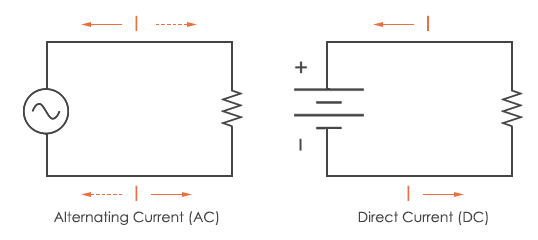
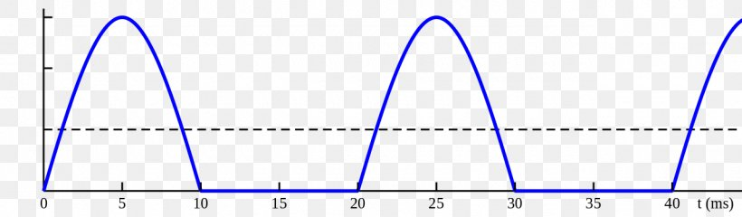
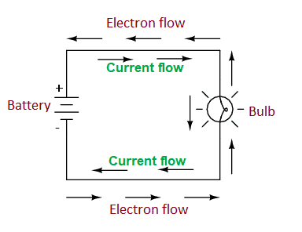
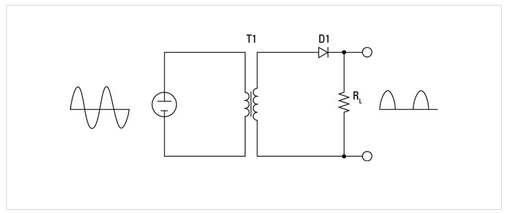
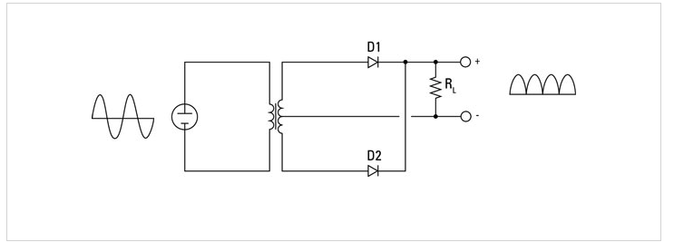
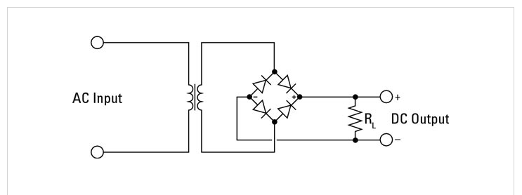

# 1. What is DC currents ? #
- DC stands for direct current.

# 2. How sine wave behaves in DC circuit? #

- 0 to 10 represents the positive region
- 10 to 20 represents the negative region.
- Thus negative region is missing for DC current because it doesn't changes polarity (positive to negative and negative to positive) over the time.
- The positive region is up and down because voltage can vary even in DC current.
- Normally voltage in DC circuit is constant throught the circuit.

# 3. Electron flow in modern circuit #

# 4. Electron flow in conventional circuit #

# 5. How to convert AC to DC using diode ? #
## 5.1 How to convert AC to DC using half-wave rectifier ##

- The simplest type of rectifier is made from a single diode. This type of rectifier is called a half-wave rectifier because it passes just half of the AC input voltage to the output.

- When the AC voltage is positive on the cathode side of the diode, the diode allows the current to pass through to the output. But when the AC current reverses direction and becomes negative on the cathode side of the diode, the diode blocks the current so that no voltage appears at the output.

- Half-wave rectifiers are simple enough to build but aren't very efficient. That’s because the entire negative cycle of the AC input is blocked by a half-wave rectifier. As a result, output voltage is zero half of the time. This causes the average voltage at the output to be half of the input voltage.

- Note the resistor marked RL. This resistor isn’t actually a part of the rectifier circuit. Instead, it represents the resistance imposed by the load that will ultimately be placed on the circuit when the power supply is put to use.

## 5.2 How to convert AC to DC using full-wave rectifier ##

- A full-wave rectifier uses two diodes, which enables it to pass both the positive and the negative side of the alternating current input. The diodes are connected to the transformer.

- Notice that the full-wave rectifier requires that you use a center-tapped transformer. The diodes are connected to the two outer taps, and the center tap is used as a common ground for the rectified DC voltage. The full-wave rectifier converts both halves of the AC sine wave to positive-voltage direct current.

- The result is DC voltage that pulses at twice the frequency of the input AC voltage. In other words, assuming the input is 60 Hz household current, the output will be DC pulsing at 120 Hz.

## 5.3 Bridge rectifier ##

- The problem with a full-wave rectifier is that it requires a center-tapped transformer, so it produces DC that’s just half of the total output voltage of the transformer.

- A bridge rectifier overcomes this limitation by using four diodes instead of two. The diodes are arranged in a diamond pattern so that, on each half phase of the AC sine wave, two of the diodes pass the current to the positive and negative sides of the output, and the other two diodes block current. A bridge rectifier doesn't require a center-tapped transformer.

- The output from a bridge rectifier is pulsed DC, just like the output from a full-wave rectifier. However, the full voltage of the transformer’s secondary coil is used.

- You can construct a bridge rectifier using four diodes, or you can use a bridge rectifier IC that contains the four diodes in the correct arrangement. A bridge rectifier IC has four pins: two for the AC input and two for the DC output.

