# What is capacitor ? #
- A capacitor is a device that stores electrical energy in an electric field. It consists of at least two electrical conductors separated by a distance.
- The space between capacitors may simply be a vacuum, and, in that case, a capacitor is then known as a “vacuum capacitor.” However, the space is usually filled with an insulating material known as a dielectric.

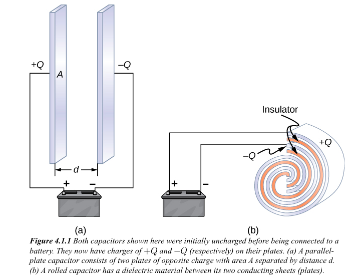

- Most of the time, a dielectric is used between the two plates. When battery terminals are connected to an initially uncharged capacitor, the battery potential moves a small amount of charge of magnitude Q from the positive plate to the negative plate. The capacitor remains neutral overall, but with charges +Q and -Q residing on opposite plates.

- The <b>capacitance </b> C of a capacitor is defined as the ratio of the maximum charge Q that can be stored in a capacitor to the applied voltage V across its plates.

```js

C = Q/V

- where Q is maximum charge that can be stored in a capacitor
-  V is applied voltage across plate
- Unit of capacitor is farad (F)

```

# Different symbols for capactors and it's meaning #
## 1. Normal capacitor ##
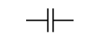

## 1. Electrolytic capacitor ##
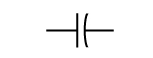


## 2. Variable air capacitance capacitor ##
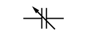

# How capacitor charging process works? #
- Capacitor performs three tasks in dc circuits i.e. taking charge, holding charge and delivering charge at certain time. When capacitor is connected to dc voltage source, capacitor starts the process of acquiring a charge. This will built up voltage across capacitor. Once capacitor has acquire enough charge, current starts flowing and soon capacitor voltage reaches at value approximately equal to dc source voltage.

- When capacitor has almost full voltage across it, no more current flows though capacitor.

-  The capacitor gets first part of total charge quickly, second part slowly, third part more slowly and so on. Hence we can say that capacitor charges non-linearly.

- Capacitor charging analogy is similar to <b>bus analogy </b>. Compare bus with capacitor, vacant seat with space and people with electrons. In bus, every person try to acquire a seat. If fewer seats remaining, people need more time to find vacant seat. Similarly, electrons try to acquire space on plate of capacitor. Here, electrons require some time to get on plates. 

## Charging time of capacitor ##
- If circuit resistance is increased, less current is available to charge a capacitor. This increases time require for capacitor to charge. As capacitance and voltage are inversely proportional to each other, increase in value of capacitance takes a longer time for capacitor to charge itself. So, with these relations we can say that the charging time of capacitor depends on both resistance of circuit and capacitance of capacitor. This is time constant of capacitor. 

- The charging time or time constant is denoted as τ (tau). It defines time taken by capacitor of “C” farads in series with resistance of “R” ohms, to acquire first part of total charge. Time constant can be mathematically define as,

```js
              Charging time = Resistance x Capacitance
                          τ = R x C
```

# How capacitor is charged ? #
```js
Here is the equation for voltage across capacitor at any instant of time during charging.

                                     Vc = Vi (1 – e-τ / RC )
Where Vc = capacitor voltage, Vi = input voltage, t = charging time, R = resistance, C = capacitance 
```
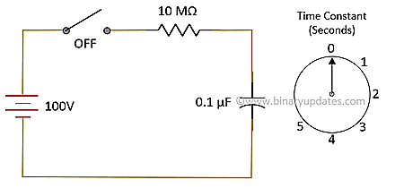

- E.g. for R = 10 MΩ and C = 0.1 µF, time constant is 1 second. This doesn’t mean that capacitor will be fully charge in 1 second. It means that capacitor will be charge to 63% of input voltage in 2 seconds. 

- If we continue to apply the voltage, capacitor takes 63% of the voltage difference between current voltage and input voltage. This process will repeat itself till capacitor acquires full charge. We get value 63% or 0.63 when we put one time constant in above equation. We can calculate current at any instance (time) in capacitor using ohms law. Consider same circuit as discussed earlier. Here is the current equation during charging of capacitor.

```js
       Ic = ( Vi – Vc ) ⁄ R
```
- The table below shows values of capacitor charging voltage and current for respective time constant.

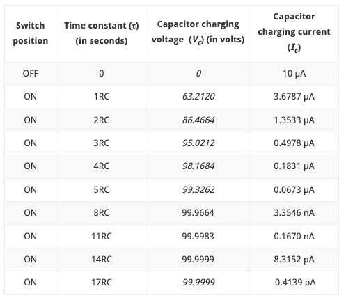

- The term 1RC, 2RC etc. defines number of times a constant voltage that must be applied to capacitor. The table above reminds important fact related to capacitor i.e. the capacitor will never store complete charge given to it.

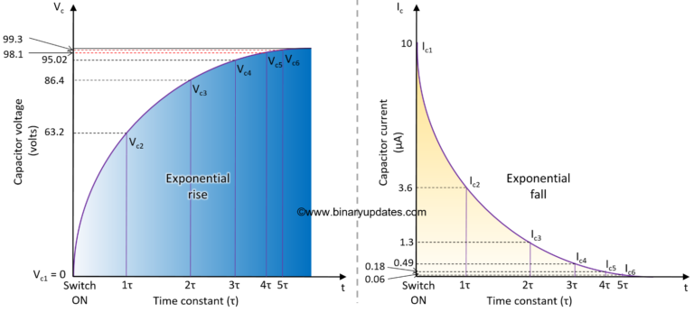

# How capacitor is discharged ? 
- There are multiple ways to discharge a charged capacitor. The easiest way is to use LED or resistor in series with capacitor. We need to take extreme care while selecting resistor or led for capacitor to discharge. It is good practice to refer specifications like wattage, value in case of resistor and forward current, voltage in case of LED before use. 

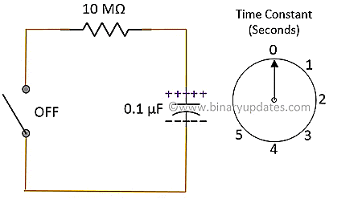

- Here are the equations for voltage across capacitor and current in capacitor at any instant of time during discharging.

```js

             Vd = Vi ( e-τ / RC)                     Id = Vd  ⁄ R
```
- The table below shows values of capacitor discharging voltage and current for respective time constant. During discharging, the voltage from which capacitor starts discharging is last charge

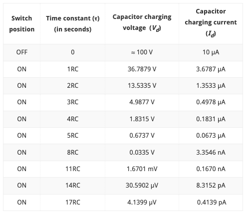

- During discharging, the capacitor voltage and current decreases quickly at 1RC second and after that there is slow decrease in both quantities. Here is the graph of capacitor discharging voltage and current. Both graphs are exponentially falling in nature. In 5RC seconds, discharging current Id ≈ 0 and discharging voltage Vd ≈ 0.

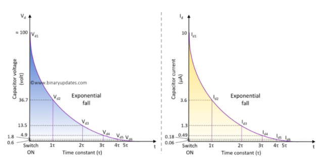

# How to utilize the capacitor charging feature with microcontroller? #

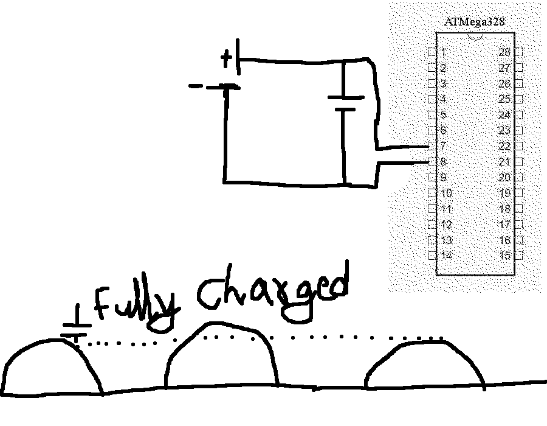

- In the above diagram, the capacitor is fully charged after first half of DC cycle and now capacitor is holding the maximum capacity. This fully charged capacitor now can be applied to mico-controller as shown above.
